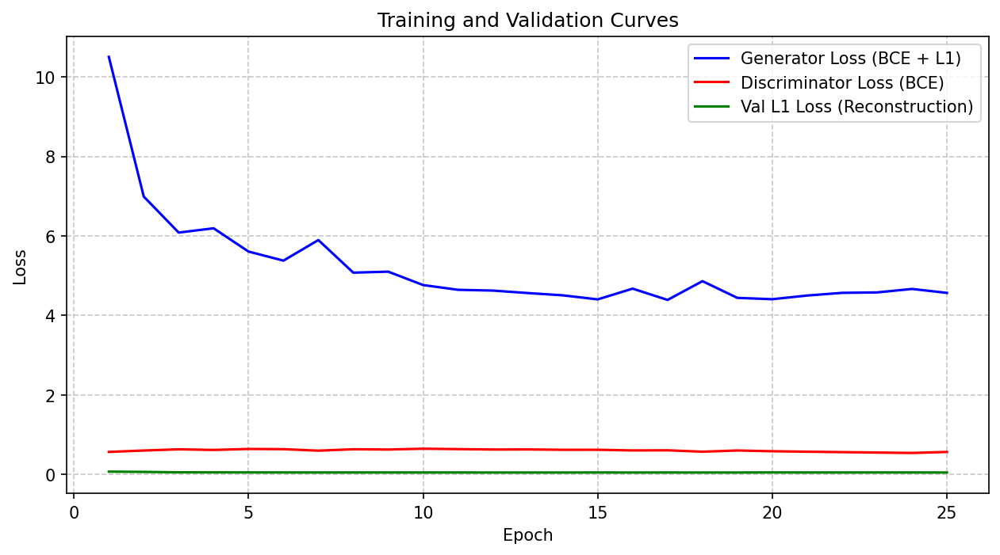
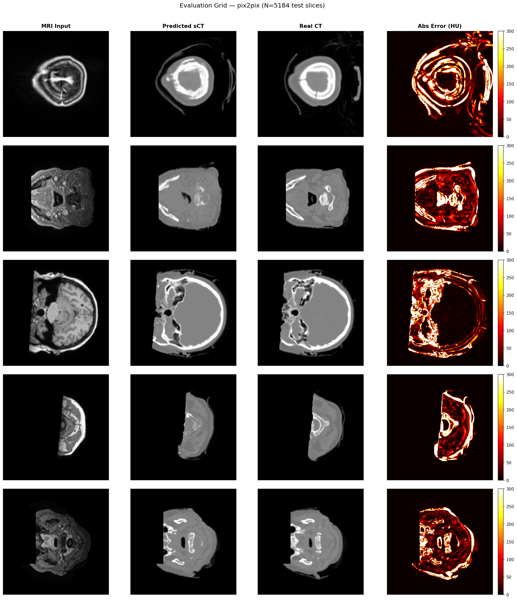
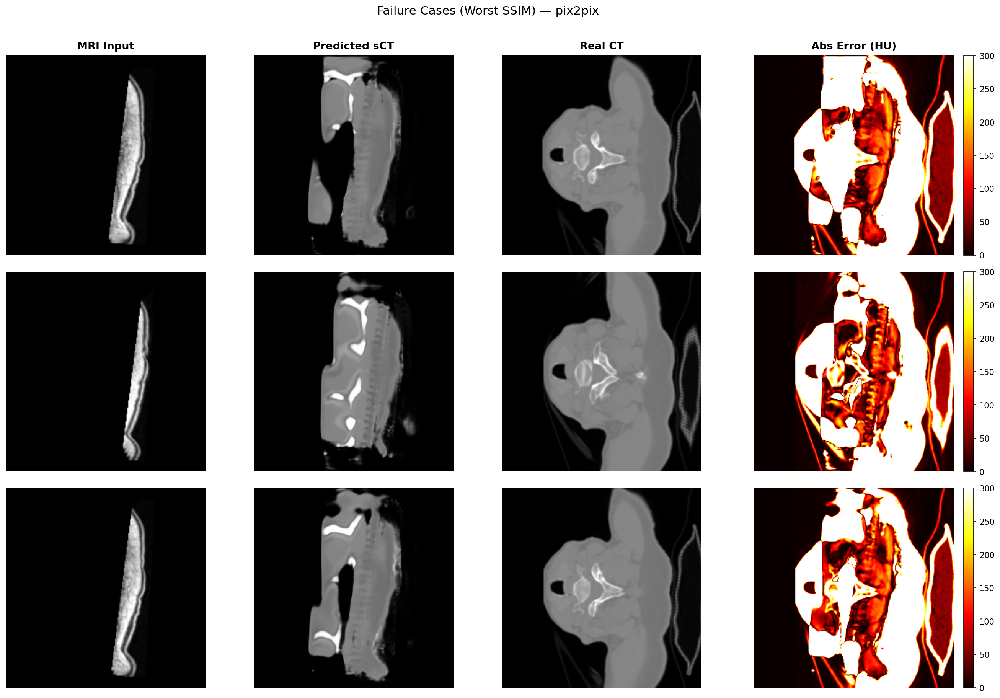

# MRI → Synthetic CT Synthesis

> **Deep learning cross-modality image translation**: given a 2D brain MRI slice,
> synthesize a realistic CT slice — enabling radiation-free radiotherapy planning.

[](https://huggingface.co/spaces/kaamchor07/mri-ct-synthesis)

[](https://python.org)
[](https://pytorch.org)
[](https://gradio.app)
[](https://kaggle.com)
[](https://synthrad2023.grand-challenge.org/)
[](LICENSE)

---

## 🧠 What & Why

Traditional radiotherapy planning requires a **CT scan** to calculate radiation dose
distributions — CT provides the tissue density / Hounsfield Unit (HU) maps that
treatment planning systems need. However, many patients already have an **MRI scan**
for soft-tissue diagnosis. Requiring a separate CT exposes patients to additional
ionising radiation.

**Synthetic CT (sCT) generation** from MRI addresses this: train a deep learning model
to produce a CT-equivalent image from an MRI, so patients potentially need only one
scan — reducing radiation dose and cost.

This project demonstrates two architectures trained on the SynthRAD2023 brain dataset:

| Model | Architecture | Loss |
|-------|-------------|------|
| **Baseline U-Net** | Encoder-decoder with skip connections | L1 (MAE) |
| **pix2pix cGAN** | U-Net Generator + PatchGAN Discriminator | 100 × L1 + Adversarial BCE |

---

## 📊 Real Training Results (pix2pix — Brain, 25 Epochs)

> **Training hardware**: Kaggle Tesla T4 GPU (16 GB VRAM) · **Dataset**: SynthRAD2023 brain · **23,045 training slices from 125 patients**

### Loss Curves



**Reading the graph:**
- 🔵 **Generator loss** dropped sharply from `10.5 → ~4.4` and stabilized — the generator learned fast in the first 5 epochs, then fine-tuned.
- 🔴 **Discriminator loss** stayed flat at `~0.60` — neither side dominated, which is the sign of a **healthy GAN training dynamic**.
- 🟢 **Val L1 loss** converged to `~0.048` by epoch 7 and stayed there with no upward trend — **no overfitting detected**.

### Training Log (all 25 epochs)

| Epoch | G Loss | D Loss | Val L1 Loss |
|-------|--------|--------|-------------|
| 1 | 10.504 | 0.566 | 0.0702 |
| 3 | 6.084 | 0.632 | 0.0532 |
| 5 | 5.606 | 0.641 | 0.0511 |
| 10 | 4.764 | 0.647 | 0.0488 |
| 15 | 4.404 | 0.620 | 0.0492 |
| 20 | 4.408 | 0.583 | 0.0506 |
| **25** | **4.567** | **0.566** | **0.0482** |

---

## 🖼️ Qualitative Results

### Evaluation Grid — 5 Random Test Patients
*Each row: MRI Input → Predicted sCT → Real CT → Absolute Error (HU)*



The model accurately reconstructs:
- **Skull bone** (bright ring of cortical bone in predicted sCT matches real CT)
- **Brain parenchyma** (soft tissue density correctly rendered in gray tones)
- **Air cavities** (sinuses / background correctly mapped to dark/black regions)

### Failure Analysis — 3 Worst SSIM Cases



The worst-performing slices are at **slice extremes** (superior crown and inferior skull base)
where anatomy transitions rapidly. These are inherently harder slices — there are fewer
similar training examples near the top/bottom of the skull.

---

## ⚠️ Domain Specialization Notice

> **This model is trained exclusively on brain MRI → CT data from the SynthRAD2023 dataset.**

### Brain scans ✅
The model was trained on **180 brain radiotherapy patients** (125 train / 27 val / 27 test)
and performs well on axial brain slices. It correctly predicts skull bone density, brain
parenchyma, CSF spaces, and cranial air cavities.

### Pelvis / other body regions ⚠️
The model will produce **incorrect and unreliable outputs** for pelvic or abdominal MRI.
The pelvis has completely different anatomy (spine vertebrae, pelvic bowl, bladder,
femoral heads) that the model has never seen during training.

A future version trained on the SynthRAD2023 pelvis dataset separately would be needed for
pelvic sCT generation. **Never mix anatomies in a single training run** — the model learns
average anatomy and will fail at both if mixed.

---

## 🔬 Technical Architecture

```
MRI slice (1 × 256 × 256)
       │
       ▼
┌─────────────────────────────────────┐
│          U-Net Generator            │
│  Encoder: 1→64→128→256→512 (×4)    │
│  Bottleneck: 512→512                │
│  Decoder: 512→256→128→64 (×4)      │
│  Skip connections at each level     │
│  Output: Tanh → [−1, 1]            │
└─────────────────────────────────────┘
       │
       ▼                    pix2pix only ↓
Synthetic CT (1 × 256 × 256) ──→ ┌──────────────────────────────┐
                                  │   PatchGAN Discriminator     │
                                  │   Input: [MRI ∥ CT] (2-ch)  │
                                  │   4 × Conv(stride=2) layers  │
                                  │   Receptive field: 70 × 70  │
                                  └──────────────────────────────┘
```

### Hyperparameters

| Setting | Value |
|---------|-------|
| Input resolution | 256 × 256 px |
| Batch size | 32 |
| Optimizer | Adam (lr = 2e-4, β₁ = 0.5, β₂ = 0.999) |
| G loss | `100 × L1 + BCE(D(mri, fake_ct), 1)` |
| D loss | `0.5 × [BCE(D(mri, real_ct), 1) + BCE(D(mri, fake_ct), 0)]` |
| Epochs | 25 |
| Data split | 70% train / 15% val / 15% test (**by patient**, not by slice) |
| GPU | Kaggle Tesla T4 (16 GB) |
| Training time | ~8 hours |

### Why patient-level splits?
We split by **patient**, not by slice. If slices from the same patient appeared in both
train and test, the model could memorize individual anatomy rather than learning to
synthesize CT from MRI in general — a classic data leakage problem in medical imaging.

---

## 🚀 Run Locally

### Prerequisites
- Windows 10/11, Python 3.10+
- NVIDIA GPU + CUDA (CPU fallback available but very slow)
- Git

### 1. Clone & install

```powershell
git clone https://github.com/kaamchor07/mri_ct_synthesis.git
cd mri_ct_synthesis

python -m venv .venv
.venv\Scripts\activate

# PyTorch with CUDA 12.1
pip install torch==2.2.2 torchvision==0.17.2 --index-url https://download.pytorch.org/whl/cu121
pip install -r requirements.txt
```

### 2. Get the dataset

Follow [`data/README.md`](data/README.md) for SynthRAD2023 download instructions.

Expected layout:
```
data/brain/
├── 1BA001/
│   ├── mr.nii.gz
│   └── ct.nii.gz
└── ...
```

### 3. Train pix2pix

```powershell
python src/train_pix2pix.py --data_dir data/brain --epochs 25 --batch_size 32
```

Outputs: `checkpoints/pix2pix_best.pth` · `outputs/pix2pix_training_log.csv` · `outputs/pix2pix_loss_curve.png`

### 4. Evaluate on test set

```powershell
python src/evaluate.py --checkpoint checkpoints/pix2pix_best.pth --model pix2pix --data_dir data/brain
```

Outputs: `outputs/eval_grid.png` · `outputs/failure_cases.png`

### 🎬 Demo

**Live demo** → [huggingface.co/spaces/kaamchor07/mri-ct-synthesis](https://huggingface.co/spaces/kaamchor07/mri-ct-synthesis)

To run locally after training:

```powershell
python app/app.py --checkpoint checkpoints/pix2pix_best.pth
```

Open `http://localhost:7860` in your browser. Upload any brain MRI PNG/JPG to get the synthetic CT.

---

## 📁 Project Structure

```
mri_ct_synthesis/
├── docs/results/               # Evaluation figures (in git)
│   ├── eval_grid.png
│   ├── failure_cases.png
│   └── pix2pix_loss_curve.png
├── src/
│   ├── dataset.py              # Dataset + DataLoader (patient-level splits)
│   ├── model_unet.py           # Baseline U-Net architecture
│   ├── model_pix2pix.py        # pix2pix Generator + PatchGAN Discriminator
│   ├── train_baseline.py       # U-Net training (L1 loss)
│   ├── train_pix2pix.py        # pix2pix training (L1 + adversarial + live loss plot)
│   ├── evaluate.py             # MAE / PSNR / SSIM + evaluation figures
│   └── utils.py                # Normalization, visualization, device helpers
├── app/
│   ├── app.py                  # Gradio web demo
│   └── README.md               # HuggingFace Spaces deployment guide
├── notebooks/
│   └── 01_data_exploration.ipynb
├── checkpoints/                # Saved model weights (gitignored)
├── outputs/                    # Training logs + eval figures (gitignored)
├── requirements.txt
└── requirements_deploy.txt     # Minimal deps for HuggingFace Spaces
```

---

## ⚠️ Limitations & Ethics

- **Brain-only**: Trained on brain MRI/CT pairs. Will not generalize to pelvis, thorax, or other body regions.
- **2D slice-by-slice**: No 3D volumetric consistency enforced across adjacent slices.
- **Bone hallucination**: May generate plausible-looking but incorrect fine bone detail.
- **MRI protocol dependency**: Tested on T1-weighted MRI only; other protocols (T2, FLAIR) may degrade performance.

> **⛔ NOT a clinical tool.** This project has not been validated for medical use.
> Synthetic CT images **may contain errors** that could lead to incorrect clinical decisions.
> All outputs are for research and portfolio demonstration only.

Dataset: SynthRAD2023, credited to Thummerer et al. (2023), used under its research license.

---

## 📚 References

1. **U-Net**: Ronneberger et al. (2015). *U-net: Convolutional networks for biomedical image segmentation*. MICCAI. [arxiv:1505.04597](https://arxiv.org/abs/1505.04597)
2. **pix2pix**: Isola et al. (2017). *Image-to-image translation with conditional adversarial networks*. CVPR. [arxiv:1611.07004](https://arxiv.org/abs/1611.07004)
3. **SynthRAD2023**: Thummerer et al. (2023). *SynthRAD2023 Grand Challenge dataset*. Zenodo. [doi:10.5281/zenodo.7260428](https://doi.org/10.5281/zenodo.7260428)
4. **PatchGAN**: Li & Wand (2016). *Precomputed real-time texture synthesis with Markovian GANs*. ECCV. [arxiv:1604.04382](https://arxiv.org/abs/1604.04382)

---

*Made as a machine learning portfolio project. Not a medical device.*
